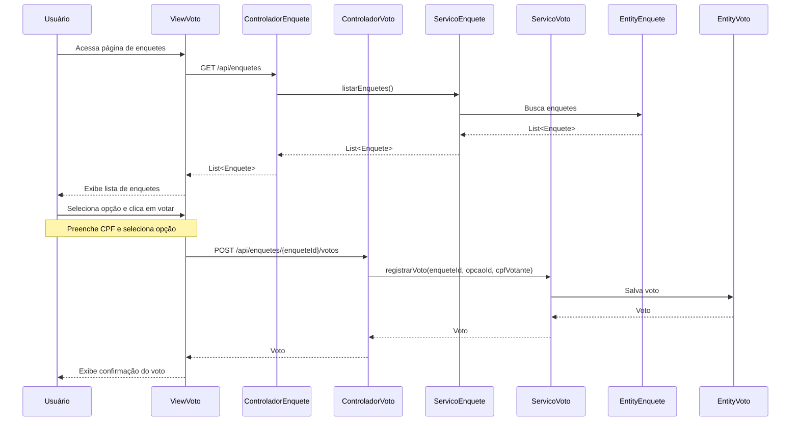

```mermaid
sequenceDiagram
    participant User as Usuário
    participant ViewVoto as ViewVoto
    participant ControladorEnquete as ControladorEnquete
    participant ControladorVoto as ControladorVoto
    participant ServicoEnquete as ServicoEnquete
    participant ServicoVoto as ServicoVoto
    participant EntityEnquete as EntityEnquete
    participant EntityVoto as EntityVoto

    %% Fluxo de Listar Enquetes
    User->>ViewVoto: Acessa página de enquetes
    ViewVoto->>ControladorEnquete: GET /api/enquetes
    ControladorEnquete->>ServicoEnquete: listarEnquetes()
    ServicoEnquete->>EntityEnquete: Busca enquetes
    EntityEnquete-->>ServicoEnquete: List<Enquete>
    ServicoEnquete-->>ControladorEnquete: List<Enquete>
    ControladorEnquete-->>ViewVoto: List<Enquete>
    ViewVoto-->>User: Exibe lista de enquetes

    %% Fluxo de Registrar Voto
    User->>ViewVoto: Seleciona opção e clica em votar
    Note over User,ViewVoto: Preenche CPF e seleciona opção
    ViewVoto->>ControladorVoto: POST /api/enquetes/{enqueteId}/votos
    ControladorVoto->>ServicoVoto: registrarVoto(enqueteId, opcaoId, cpfVotante)
    ServicoVoto->>EntityVoto: Salva voto
    EntityVoto-->>ServicoVoto: Voto
    ServicoVoto-->>ControladorVoto: Voto
    ControladorVoto-->>ViewVoto: Voto
    ViewVoto-->>User: Exibe confirmação do voto
``` 